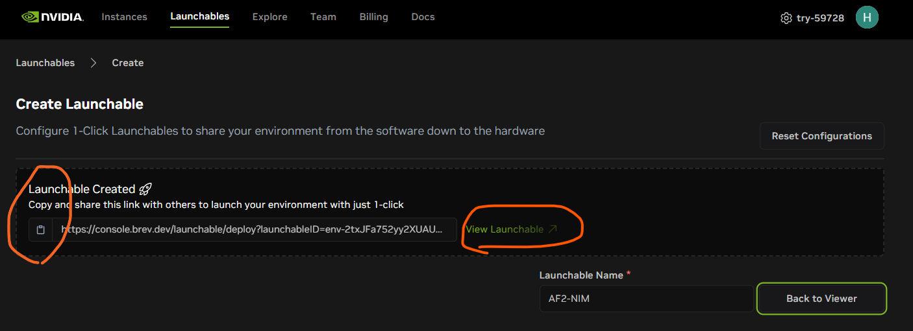
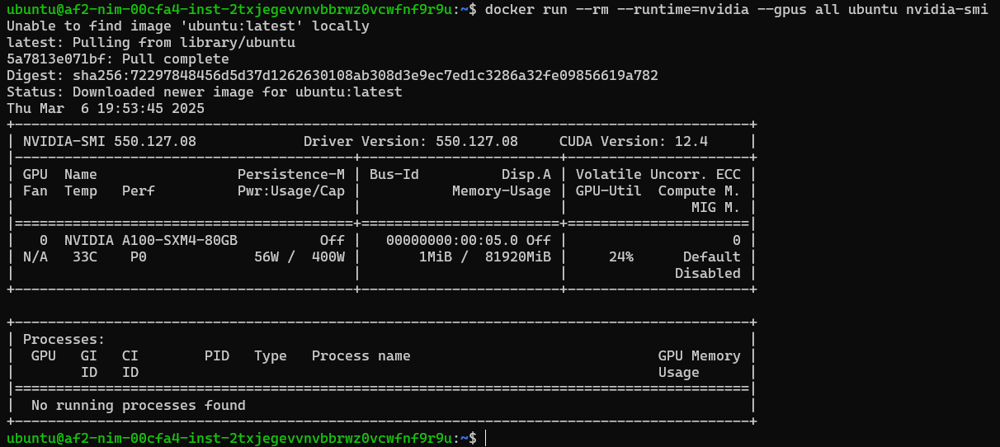
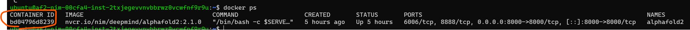

# Tutorial_AF2_NIM_Brev
A step-by-step tutorial for deploying and using NVIDIA AlphaFold2 NIM on NVIDIA Brev. <br>

**NOTE**: The first time you run the AF2 NIM container, the APIs will take approximately 3–4 hours to become ready due to the downloading of large databases exceeding 1TB. <br>

This tutorial mainly combines instructions from [Deploying NIMs on Brev](https://docs.nvidia.com/brev/latest/deploying-nims.html) section of the Brev doc and [Quickstart Guide](https://docs.nvidia.com/nim/bionemo/alphafold2/latest/quickstart-guide.html) section of AF2 NIM doc. For more details, please refer to those docs. It is also highly recommended to go through the rest of Brev doc and AF2 NIM doc.

### Creat Brev Account
Create an account on Brev if you haven't already. You can do this by clicking the “Create an account” button in the top right corner of the [Brev Console](https://console.brev.dev/org/org-2tcmRZuGMBx9Wlh2bxmuIdGb6UN/environments).

### Install Brev CLI
- Follow [Installation Instructions](https://docs.nvidia.com/brev/latest/brev-cli.html#installation-instructions) for Mac, Linux and Windows.
    - Quick setup for Windows. If you don't have WSL2 installed on your Window now, just following this section [Install WSL command](https://learn.microsoft.com/en-us/windows/wsl/install#install-wsl-command) should be enough.
- You are encouraged to familiarize yourself with the frequently used Brev CLI commands below, since we'll use them in the next steps. Please refer to the [Brev CLI doc](https://docs.nvidia.com/brev/latest/brev-cli.html#) for details.
    ```
    brev login
    ```
    ```
    brev refresh
    ```
    ```
    brev ls
    ``` 

### Create Launchable & Deploy Instance
- A "Launchable" is a template of setting up an instance.
- Open a web browser and go to [Brev Console](https://console.brev.dev/org/org-2tcmRZuGMBx9Wlh2bxmuIdGb6UN/environments).
    - Create an account on Brev if you haven't already. You can do this by clicking the “Create an account” button in the top right corner of the Console.
    - Click "Launchables" tab in the top menu bar. <br>
     <br>
    - Click "Create Launchables". <br>
     <br>
    - Click "compute" -> "A100" -> "80GiB GPU Memory | 1 GPU • 170GiB RAM • 12 CPUs | GCP • $7.44/hr". <br>
     <br>
    - Type *1500* under "Storage (GiB)", then click "Save Compute". <br>
     <br>
    - Click "Container" -> Toggle the "Prestall Jupyter" switch to turn it on -> Click "VM Mode" box -> "Save Container". <br>
     <br>
    - Click "Files" -> Copy & paste the link to the tutorial Jupyter Notebook for calling AF2 NIM APIs - [call_API.ipynb](call_API.ipynb) -> Click "Add file". <br>
     <br>
    - Type under "Name Launchable", e.g., *AF2-NIM* -> Click "Generate Launchable". <br> 
     <br>
    - Click "View Launchable". <br>
    **Note that now you can copy & paste the link to this Launchable to share it with your friends, including all configurations such as compute, environment, and Jupyter Notebook, to make your work so much more reproducible.** <br>
     <br>
    - Click "Deploy Launchable". <br>
     <br>
    - Click "Go to Instance Page" when it becomes available and starts flashing. <br>
     <br>
    - You should now be on the instance page, as shown below. <br>
        - It might take a few minutes before you see the 'Running' status and button "Open Notebook" starts flashing. <br>
    

### Required Utilities
In your local terminal where you installed Brev CLI:
- Log in to your Brev account by following the prompts.
    ```
    brev login
    ```
    

- Print all your Brev instances. When the "STATUS" shows "RUNNING", proceed to the next step.
    ```
    brev ls
    ```
    

- SSH into your instance. 
    - It might take a while for it to become ready. 
    - When it's ready, you should see something like the screenshot below. Note that the prompt has changed.
    ```
    brev shell <instance-name>
    ```
    

- Verify your container runtime supports NVIDIA GPUs.
    ```
    docker run --rm --runtime=nvidia --gpus all ubuntu nvidia-smi
    ```
    

- Generate NGC API Key.
    - Open a web browser and go to https://org.ngc.nvidia.com/setup/api-key.
    - You might be prompted to login or to register for a free account.
    - Click "+ Generate API Key" and then copy & paste the key to somewhere local. <br>
     

- Set up NGC CLI by following the section [NGC CLI Tool](https://docs.nvidia.com/nim/bionemo/alphafold2/latest/prerequisites.html#ngc-cli-tool) in the AF2 NIM doc. Please refer to this doc for explanation. I have put specific commands below:
    ```
    sudo apt install unzip
    ```


    ```
    wget --content-disposition https://api.ngc.nvidia.com/v2/resources/nvidia/ngc-apps/ngc_cli/versions/3.41.3/files/ngccli_linux.zip -O ~/ngccli_linux.zip && \
    unzip ~/ngccli_linux.zip -d ~/ngc && \
    chmod u+x ~/ngc/ngc-cli/ngc && \
    echo "export PATH=\"\$PATH:~/ngc/ngc-cli\"" >> ~/.bash_profile && source ~/.bash_profile
    ```

    Follow the prompts of the command below. Note that you need to copy & paste your NGC API Key at the first prompt.
    ```
    ngc config set 
    ```   
     <br>

    
    For the command below, 
    - copy & paste "$oauthtoken" for the "Username" prompt.
    - copy & paste your NGC API Key at the "Password" prompt.
    ```
    docker login nvcr.io
    ```
     <br>

    List available NIMs, e.g., the AI models originally developed by deepmind:
    ```
    ngc registry image list --format_type csv nvcr.io/nim/deepmind/*
    ```
    

### Deploy AF2 NIM
- Set up the NIM cache
    - Create the NIM cache directory
        ```
        mkdir -p ~/.cache/nim
        ```
        
    - Set the NIM cache directory permissions to the correct values
        ```
        chmod -R 777 ~/.cache/nim
        ```
        

- Pull the AF2 NIM container. Might take about five minutes.
    ```
    docker pull nvcr.io/nim/deepmind/alphafold2:2.1.0
    ```
    
    When it's done, you should see:
    

- Set the two environmental variables below one-by-one, which will be passed into the container in the next step.
    ```
    export LOCAL_NIM_CACHE=~/.cache/nim
    export NGC_API_KEY=<Your NGC API KEY>
    ```
    

- `docker run` the NIM container for the **first time**. 
    - Why use `nohup`: prevents the process from stopping when the terminal session is closed or disconnected.
    ```
    nohup docker run --rm --name alphafold2 --runtime=nvidia \
    -e NGC_API_KEY \
    -v $LOCAL_NIM_CACHE:/opt/nim/.cache \
    -p 8000:8000 \
    nvcr.io/nim/deepmind/alphafold2:2.1.0  > af2_nim.log 2>&1 &
    ```
    

- Monitor the log of the running NIM container.
    ```
    tail -f af2_nim.log
    ```
     <br>

    You can quit monitoring the log anytime by pressing `Ctrl + C`. <br>
    To re-monitor the log, run the tail command above again.

    - The first time you run the AF2 NIM container, the log will hang at the status shown in the screenshot above for a long time. The APIs will take approximately 3–4 hours to become ready due to the downloading of large databases exceeding 1TB. 
    - The screenshot below indicates when the APIs are ready. <br>
    

- Delete the NIM container when you're done with calling the NIM APIs.
    - Get the ID of the running NIM container <br>
    ```
    docker ps
    ```
     <br>

    - Kill the running NIM contaienr <br>
    ```
    docker kill <container_ID>
    ```
     <br>

- `docker run` the NIM container **after the first run**.
    After the first run, the model weights are already downloaded. Pass `NIM_DISABLE_MODEL_DOWNLOAD=True` as an environment variable to the container to speed up the startup (almost instant startup).
    ```
    export NIM_DISABLE_MODEL_DOWNLOAD=True
    ```
    ```    
    nohup docker run --rm --name alphafold2 --runtime=nvidia \
        -e NIM_DISABLE_MODEL_DOWNLOAD \
        -e NGC_API_KEY \
        -v $LOCAL_NIM_CACHE:/opt/nim/.cache \
        -p 8000:8000 \
        nvcr.io/nim/deepmind/alphafold2:2.1.0  > af2_nim.log 2>&1 &
    ```

### Run Tutorial Jupyter Notebook - call AF2 NIM APIs
- Click on the flashing "Open Notebook" button. <br>
 <br>
- You should now be directed to a Jupyter Lab that appears in your web browser. If it doesn’t load, try refreshing the page. <br>
Close up the benign error if it pops up. <br>
 <br>
Double click the tutorial Jupyter Notebook `call_API.ipynb` in the left panel to open it up. <br>
 <br>
- You're ready to run the tutorial Jupyter Notebook. <br>


